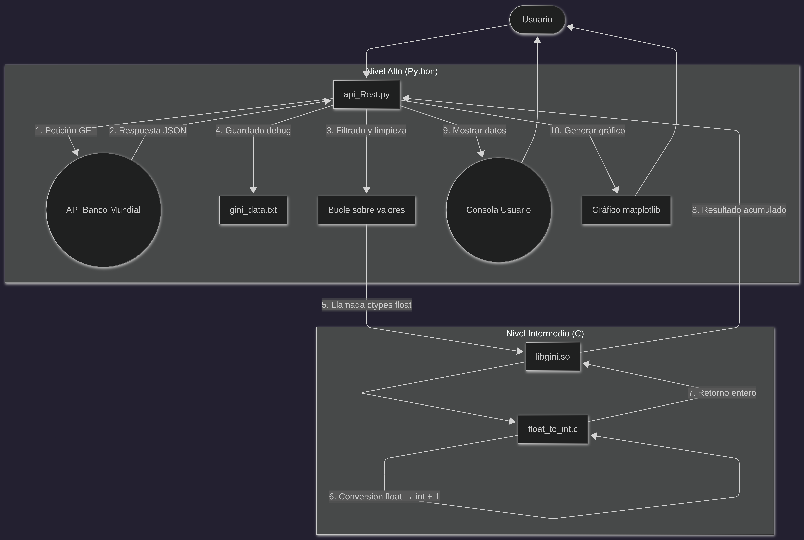
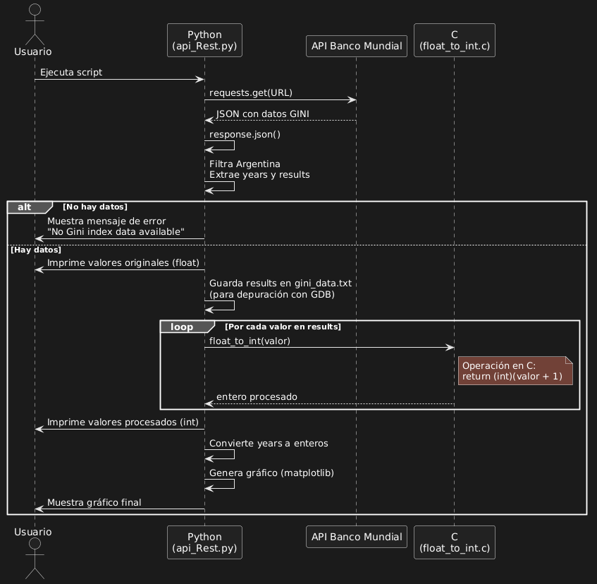
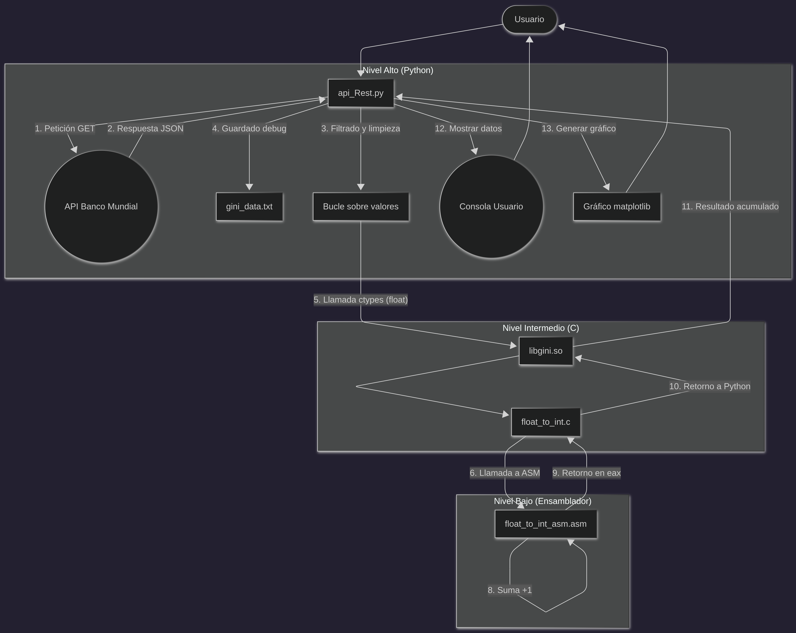
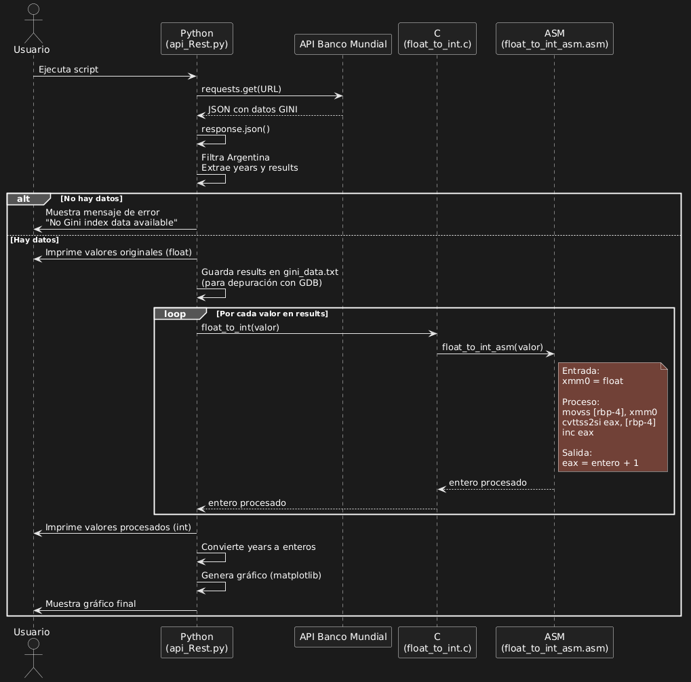
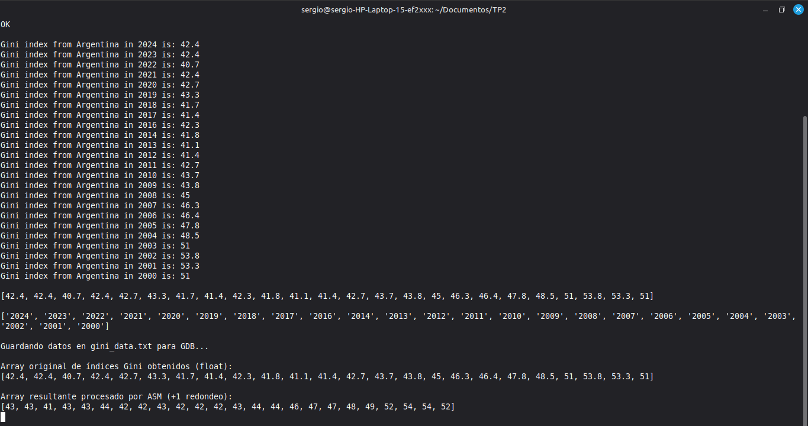
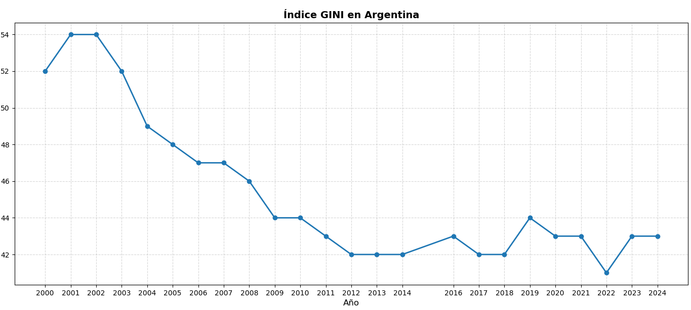
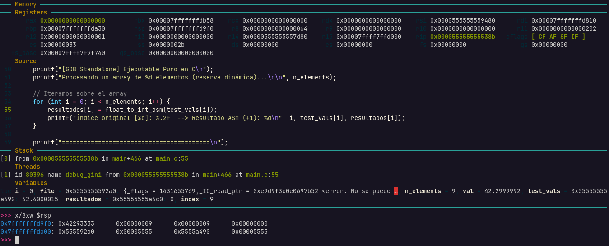
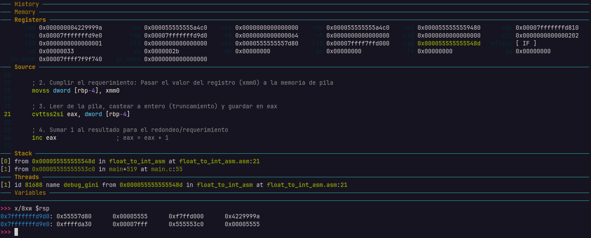
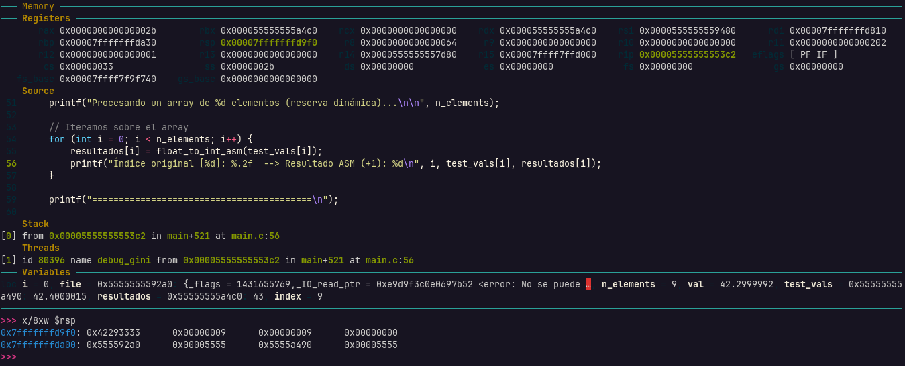

# Trabajo Practico N°2: Stack Frame

### Asignatura: Sistemas de Computacion

**Facultad de Ciencias Exactas, Físicas y Naturales (UNC)**

---

* **Grupo:** Sudo Make A Sandwich
* **Profesores:** Miguel Angel Solinas y Javier Alejandro Jorge

---

### Integrantes y Contacto

| Nombre y Apellido | Correo Electrónico |
| :--- | :--- |
| **Sergio Andres Fernandez Segovia** | _sergio.fernandez.segovia@mi.unc.edu.ar_ |
| **Enzo Leonel Laura Surco** | _enzo.laura.surco@mi.unc.edu.ar_ |
| **Saqib Daniel Mohammad Cabrejos** | _saqib.mohammad@mi.unc.edu.ar_ |

## 1. Introducción
Dentro del desarrollo de aplicaciones informaticas resulta sumamente comun trabajar con diferentes niveles de abstraccion, lo que permite organizar la complejidad de un sistema. Por ejemplo, en las niveles superiores se trabajan con lenguajes de alto nivel ya que brindan herramientas mas accesibles para el programador, facilitando notablemente la implementacion de soluciones sin tener la necesidad de interactuar de manera directa con el hardware. Sin embargo, en cierta forma, todo programa depende de los mecanismos de bajo nivel, los cuales permiten su efectiva ejecucion.

Por lo tanto, una forma de poder estar mas cerca del funcionamiento interno de un sistema, es a traves del lenguaje ensamblador, el cual permite trabajar de manera bastante directa con todos los recursos que se encuentran en el hardware. Ahora bien, para lograr establecer una comunicacion entre distintos niveles se tiene en cuenta lo que se conoce como Convencion de Llamadas, se trata de un conjunto de reglas que indican como se organizan las tareas. 

A partir de esta idea, en el presente trabajo practico se desea integrar herramientas provenientes de los distintos niveles de abstraccion, lo que permitira conocer y comprender como interactuan las capas de un sistema. Para ello, se propone la siguiente arquitectura:
- **Capa Superior:** Python
- **Capa Intermedia:** C
- **Capa Inferior:**  ASM

---

## 2. Objetivo
El objetivo principal del trabajo practico es obtener el índice GINI de la República Argentina desde la API REST del Banco Mundial, y realizar una operación de truncamiento e incremento numérico de dicho índice.

Para alcanzar este resultado, la solución se estructuró de manera incremental:
- **Primera Iteracion:** Implementación de alto nivel utilizando Python como cliente API y C como capa intermedia de procesamiento numérico.
- **Segunda Iteracion:** Introducción de la capa inferior en Lenguaje Ensamblador (x86-64) para realizar el procesamiento nativo. Además, se desarrolló un programa en C puro (`main.c`) dedicado exclusivamente a depurar y observar el comportamiento de la pila (Stack) utilizando GDB.

Finalmente, el flujo de desarrollo, compilación y ejecución fue fuertemente optimizado mediante la inclusión de un `Makefile` y un script automatizado `setup.sh`.

## 2. Arquitectura e Implementación

### 2.1. Primera Iteracion
#### Capa Superior: Cliente Python (`api_Rest.py`)
Constituye el punto de entrada de la aplicación en el espacio de usuario.
1. Ejecuta una petición HTTP GET síncrona (bloqueante) a la API del Banco Mundial para extraer el JSON con las respuestas.
```python
import requests
import ctypes
import matplotlib.pyplot as plt

results = []
years = []
last_gini_index = None
file = None

response = requests.get('https://api.worldbank.org/v2/en/country/all/indicator/SI.POV.GINI?format=json&date=2000:2026&per_page=32500&page=1&country=%22Argentina%22')
if response:
    print("OK")
else:
    print("Error:", response.status_code)
```

2. Filtra y limpia los datos nulos para rescatar únicamente los índices de Argentina.
```python
data = response.json()
not_metadata = data[1]

for i in not_metadata:
    if i["country"]["value"] == "Argentina":
        if i["value"] is not None: 
            print("Gini index from Argentina in", i["date"], "is:", i["value"])
            results.append(i["value"])
            years.append(i["date"])
```
3. Invoca la librería dinámica compilada (`libgini.so`) mediante `ctypes`, pasando el valor decimal como `float`.
```python
# Cargar la libreria compartida
lib = ctypes.CDLL("./libgini.so")

# Definimos los argumentos de la funcion y el tipo de retorno
lib.float_to_int.argtypes = [ctypes.c_float]
lib.float_to_int.restype = ctypes.c_int

# Procesamos TODO el array dinámicamente llamando a la función en ASM
resultados_enteros = []
for val in results:
    entero_redondeado = lib.float_to_int(float(val))
    resultados_enteros.append(entero_redondeado)
```

4. Recibe e imprime el resultado final calculado por los niveles subyacentes.
```python
print()
print("Array original de índices Gini obtenidos (float):")
print(results)
print()
print("Array resultante procesado por ASM (+1 redondeo):")
print(resultados_enteros)
```

5. Grafica una curva con los datos extraidos
```python
# Graficamos los datos
anios_enteros = [int(a) for a in years]

plt.figure(figsize=(30, 5))
plt.plot(anios_enteros, resultados_enteros, marker='o', linewidth=2)

plt.title('Índice GINI en Argentina', fontsize=14, fontweight='bold')
plt.xlabel('Año', fontsize=12)
plt.ylabel('GINI', fontsize=12)

plt.grid(True, linestyle='--', alpha=0.5)
plt.xticks(anios_enteros)
plt.tight_layout()

plt.show()
```

#### Capa Intermedia: Procesamiento en C (`float_to_int.c`)
En esta primera iteración, el lenguaje C asume completamente la responsabilidad del procesamiento de los datos.
- Implementa la función `float_to_int`, la cual recibe un valor de tipo `float`.
- Realiza la conversión de tipo mediante casting explícito a entero.
- Aplica la operación requerida por la consigna, sumando una unidad al valor convertido `((int)(indice_gini + 1))`.
- Retorna el resultado directamente al cliente Python.
```c
#include "stdio.h"
#include "math.h"

// Funcion para castear un numero flotante a entero
int float_to_int(float indice_gini){
    return (int)(indice_gini + 1);
}
```
### 2.2. Segunda Iteracion

#### Capa Superior: Cliente Python (`api_Rest.py`)
No sufre modificaciones. Continua siendo el punto de entrada de la aplicación en el espacio de usuario y se mantienen sus funciones.
1. Ejecuta una petición HTTP GET síncrona (bloqueante) a la API del Banco Mundial para extraer el JSON con las respuestas.
2. Filtra y limpia los datos nulos para rescatar únicamente los índices de Argentina.
3. Invoca la librería dinámica compilada (`libgini.so`) mediante `ctypes`, pasando el valor decimal como `float`.
4. Recibe e imprime el resultado final calculado por los niveles subyacentes.
5. Grafica una curva con los datos extraidos

#### Capa Intermedia: Interfaz C (`float_to_int.c` y `main.c`)
En esta versión definitiva, C funciona puramente como un "wrapper" sin apenas sobrecarga hacia Ensamblador:
- En la librería compartida, procesa los llamados de Python derivándolos a `float_to_int_asm` recibiendo el tipo `float`.
- Para propósitos de *debugging* del stack, se generó un binario auto-contenido (`debug_gini` a partir de `main.c`) que carga los flotantes temporalmente extraídos a un `gini_data.txt` para iterar de forma pura las llamadas a ASM. Esto prevé el enorme *overhead* o complejidad que implicaría depurar el intérprete de Python completo con GDB.
```C
#include "stdio.h"

/*Agregar el extern del ensamblador*/
extern int float_to_int_asm(float);

// Funcion para castear un numero flotante a entero
int float_to_int(float indice_gini){
    // Delegamos la lógica matemática a nuestra función nativa en NASM
    return float_to_int_asm(indice_gini);
}
```

#### Capa Inferior: Ensamblador x86-64 (`float_to_int_asm.asm`)
Motor lógico principal del trabajo práctico. Se adhiere estrictamente a la convención **ABI de System V AMD64**:
- Recibe el argumento de punto flotante a través de los registros vectoriales SSE (registro `xmm0` en particular).
- Lo transfiere localmente a la memoria de la pila mediante el stack frame para lectura/escritura predecible.
- Utiliza la instrucción de conversión directa con truncamiento en procesadores paralelos (`cvttss2si`) hacia el registro `eax` (tamaño de 32-bits / dword).
- Modifica el resultado entero directo truncado sumando la unidad requerida por consigna (`inc eax`).
- Retorna el valor alojado en `rax`.
``` ASM
global float_to_int_asm

section .text

; Firma: int float_to_int_asm(float x)
; En la ABI System V (x86-64 en Linux), el primer argumento (float) llega en el registro xmm0.
; El retorno (int) debe dejarse en eax.

float_to_int_asm:
    ; 1. Prólogo del Stack Frame
    push rbp                ; Guardamos el base pointer anterior
    mov rbp, rsp            ; Establecemos nuestro propio base pointer
    
    ; Reservamos espacio en la pila para variables locales (16 bytes para alinear a 16)
    sub rsp, 16             

    ; 2. Cumplir el requerimiento: Pasar el valor del registro (xmm0) a la memoria de pila
    movss dword [rbp-4], xmm0

    ; 3. Leer de la pila, castear a entero (truncamiento) y guardar en eax
    cvttss2si eax, dword [rbp-4] 

    ; 4. Sumar 1 al resultado para el redondeo/requerimiento
    inc eax                 ; eax = eax + 1

    ; 5. Epílogo del Stack Frame
    mov rsp, rbp            ; Restauramos el stack pointer
    pop rbp                 ; Restauramos el base pointer
    ret                     ; Retornamos a la función invocadora (en C)
```

---

## 3. Diagramas del Sistema
A continuación, se ilustran tanto la arquitectura en bloque como el flujo de interacciones del sistema:

### 3.1. Primera Iteracion

#### Diagrama de Flujo


#### Diagrama de Secuencias


### 3.2. Segunda Iteracion

#### Diagrama de Flujo


#### Diagrama de Secuencias


---

## 4. Resultados
A continuación, se muestran los resultados que se devuelven tras ejecutar el script:

### 4.1. Valores mostrados


### 4.2. Curva del Indice GINI


---

## 5. Análisis de Memoria y Pila (Stack) con GDB

Como parte vital de la Segunda Iteracion, se hizo uso intensivo del ejecutable puente en C (`debug_gini`) para observar visualmente la asignación de variables de entorno, carga/desplazamiento de registros y particularmente el diseño en memoria de la pila (*Stack*), deteniendo paso a paso los llamados al submódulo en ensamblador. 

Se analizaron 3 estados críticos del marco de la pila durante la iteración 1 del loop, correspondientes al truncado e incremento desde nuestro primer registro GINI de **`42.4`** a **`43`**.

### 1. Estado Previo de Variables (Antes del Llamado)
En el punto de pausa de GDB en `main.c:55`, el sistema gestiona dinámicamente nuestra memoria reservada en el *Heap* correctamente. Las instancias de variables intervinientes `test_vals` (`0x55555555a490`) y `resultados` (`0x55555555a4c0`) están intactas, listas para invocar el cast del flotante situado en índice 0.  



### 2. Stack Frame y Flotantes durante Rutina Ensamblador
Al profundizar el paso al interior de NASM, lo primero que se ejecuta es el **prólogo del stack** (`push rbp`, `mov rbp, rsp` y `sub rsp, 16`). Esto resguarda de forma segura el marco de la función llamadora (C) y establece nuestro propio alcance en la pila (*stack frame*) para operar con almacenamiento local.
A nivel de registros, el pasaje del argumento se concreta recibiendo el valor de punto flotante directamente en el registro vectorial **`xmm0`**, respetando la convención (ABI). Para cumplir la consigna explícita de usar referencias a la memoria apilada, transferimos este parámetro al _stack frame_ recién creado a través de: `movss dword [rbp-4], xmm0`.  
Dentro del recuadro inferior de *Variables*, confirmamos al volcar la pila local (`x/8xw $rsp`), la existencia predecible y exacta en este offset de su estándar IEEE-754: **`0x4229999a`** (42.4 representado binariamente). 
Acto seguido, la variable es leída de vuelta (`cvttss2si`) para truncarla a 42 en `eax` e invocar el incremento (`inc eax`).



### 3. Regreso y Actualización (Luego del Llamado)
Con la pila saneada en el ASM (*epílogo*), el valor saliente del acumulador `rax` alberga a su retorno el éxito de la función, siendo su hexadecimal `0x00002b` o el equivalente estricto a **43**. Esta cifra se implanta limpia y puramente en nuestro puntero de índice inicial del array `resultados` sin leaks ni corrupciones de buffer.



---

## 6. Instrucciones de Construcción y Ejecución Mejoradas (Segunda Iteracion)

El proyecto actual posee todo su flujo de despliegue consolidado para que otros ambientes puedan consumirlo fluidamente:

1. **Automatización de Setup y Componentes (Recomendado)**
Se generó el script envolvente `setup.sh`, encargado de forzar la creación íntegra del entorno en bash, su virtualización python, librerías, y despachar recursivamente nuestra compilación nativa en MAKE:
```bash
cd TP2
chmod +x setup.sh
./setup.sh
```

2. **Ejecución Principal de la Solución**
Asegurando estar en el ambiente provisto `.venv` (ya resuelto si ejecutaste el setup):
```bash
python3 api_Rest.py
```

3. **Arquitectura con Makefile (Opcional - Debug Técnico)**
Para modificar capas medias, depurar GDB u obligar ensambles de archivos parciales (`.o`, `.so` o binarios), el `Makefile` simplifica y ordena todas las piezas nativas C-ASM que conviven bajo nuestra abstracción:
```bash
make          # Construye librerías dinámicas y ejecutables de forma integral
make clean    # Limpia artefactos intermedios y binarios producidos
```
