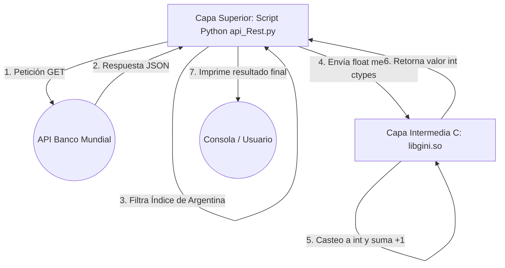

# Informe Trabajo Práctico 2 - Primera Iteración

## 1. Introducción y Objetivo
Este informe documenta la primera iteración del trabajo práctico, cuyo objetivo es recuperar el índice GINI de la República Argentina desde la API REST del Banco Mundial y procesarlo. Cumpliendo con la consigna, en esta instancia inicial la solución ha sido implementada exclusivamente utilizando Python (capa superior) y C (capa intermedia), sin la inclusión de lenguaje ensamblador todavía.

## 2. Arquitectura e Implementación

### Capa Superior: Python (`api_Rest.py`)
El script de Python actúa como el punto de entrada y cliente de la aplicación:
1. **Recolección de datos:** Ejecuta una petición `GET` a la API del Banco Mundial a través de la librería `requests`.
2. **Filtrado:** Analiza el archivo JSON obtenido, localizando todos los registros de Argentina y descartando los datos nulos (`None`). Luego, identifica el índice de GINI correspondiente al año más reciente.
3. **Integración con C:** Importa la librería de sistema `ctypes` para cargar dinámicamente la biblioteca compartida compilada en C (`libgini.so`).
4. **Ejecución y Feedback:** Define la firma y los tipos de dato (invocando argumento como `float` y retorno de tipo `int`), ejecuta la función expuesta por C y finalmente imprime por consola el índice convertido.

### Capa Intermedia: C (`float_to_int.c`)
En esta primera instancia, el archivo en C cumple la función de "puente" y lógica de casteo de prueba:
- Recibe el parámetro numérico base como coma flotante (`float`).
- Ejecuta una operación de *casting* directa desde C a entero (`int`).
- Al resultado truncado le suma `1` tal como lo especifica el requerimiento.
- Retorna el valor final calculado para que sea consumido y mostrado por la capa superior.

### Diagrama de Bloques (Primera Iteración)

A continuación, se presenta un diagrama esquemático generado con **Mermaid** (soportado nativamente por GitHub) para ilustrar la arquitectura y el flujo de los datos implementados hasta ahora:



## 3. Guía de Ejecución
Para poder ejecutar correctamente, primero se debe compilar el módulo de C en una librería dinámica compartida:
```bash
gcc -shared -o libgini.so -fPIC float_to_int.c
```
Luego, se recomienda preparar un entorno virtual (`venv`) antes de ejecutar, para no interferir con las librerías globales del sistema:
```bash
# 1. Crear entorno virtual (ejecutar una sola vez)
python3 -m venv venv

# 2. Activar el entorno virtual
source venv/bin/activate  # En Linux/Mac
# venv\Scripts\activate   # En Windows

# 3. Instalar las dependencias necesarias
pip install requests

# 4. Invocar el programa
python3 api_Rest.py
```

## 4. Próximos pasos (Segunda Iteración)
Para la entrega final, siguiendo los requerimientos del trabajo práctico:
- El código en C dejará de realizar la operación aritmética y el redondeo directamente, y pasará a invocar una subrutina escrita nativamente en **Ensamblador (x86-64)**.
- Se implementará el uso correcto de las convenciones de pasaje de parámetros mediante el **Stack**.
- Se llevará a cabo una sesión de depuración con **GDB** registrando el comportamiento y las direcciones de memoria del *stack frame* (antes, durante y después del llamado a la rutina de ensamblador).
