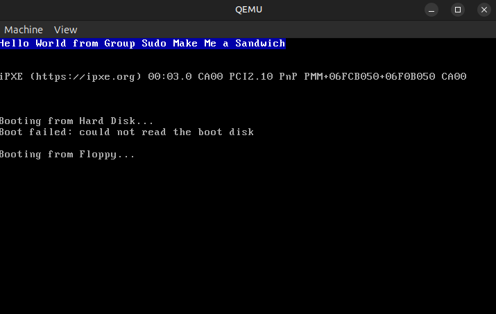
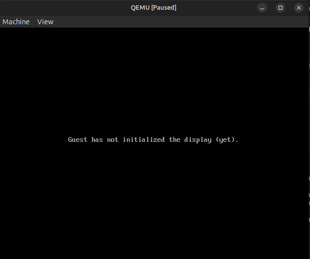

# Trabajo Práctico N°3: Modo Protegido

### Asignatura: Sistemas de Computación

**Facultad de Ciencias Exactas, Físicas y Naturales (UNC)**

---

* **Grupo:** Sudo Make A Sandwich
* **Profesores:** Miguel Angel Solinas y Javier Alejandro Jorge

---

### Integrantes y Contacto

| Nombre y Apellido | Correo Electrónico |
| :--- | :--- |
| **Sergio Andrés Fernández Segovia** | _sergio.fernandez.segovia@mi.unc.edu.ar_ |
| **Enzo Leonel Laura Surco** | _enzo.laura.surco@mi.unc.edu.ar_ |
| **Saqib Daniel Mohammad Cabrejos** | _saqib.mohammad@mi.unc.edu.ar_ |


## 4.- Desafio Final: Modo Protegido 

Basándonos en el código proporcionado "common.h", implementamos un código en ensamblador "protected_mode.asm" que nos permite entrar en modo protegido e imprimir "Hello World".

El código que se realizó es el siguiente:

```assembly
; protected_mode.asm

; Establecemos el modo real de 16 bits y la direccion de memoria

[BITS 16]
[ORG 0x7C00]

start:
    ;deshabilitamos interrupciones
    cli

    ;cargamos la GDT
    lgdt [gdt_descriptor]

    ;activamos el modo protegido activando el bit 0 del registro CR0
    mov eax, cr0
    or eax, 1
    mov cr0, eax
    
    ;realizamos un salto largo hacia el codigo del modo protegido
    jmp CODE_SEG:protected_mode


;===========================
; GDT
;===========================

gdt_start:

gdt_null:
    dq 0

gdt_code:
    dw 0xFFFF
    dw 0x0000
    db 0x00
    db 10011010b
    db 11001111b
    db 0x00

gdt_data:
    dw 0xFFFF
    dw 0x0000
    db 0x00
    db 10010010b
    db 11001111b
    db 0x00

gdt_end:

gdt_descriptor:
    dw gdt_end - gdt_start - 1
    dd gdt_start

CODE_SEG equ gdt_code - gdt_start
DATA_SEG equ gdt_data - gdt_start

;===========================
; PROTECTED MODE
;===========================

[BITS 32] ; Modo protegido usa 32 bits
protected_mode:
     ; cargamos los segmentos de datos ya no direcciones
     mov ax, DATA_SEG
     mov ds, ax
     mov es, ax
     mov ss, ax
     mov fs, ax
     mov gs, ax
     
     ; cargamos la direccion de memoria en el stack
     mov ebp, 0x90000 ; no pisamos codigo ni VGA
     mov esp, ebp

     ; Imprimimos "Hello World" en modo protegido
     mov edi, 0xB8000 ; direccion de memoria VGA
     mov esi, mensaje

print_loop:
    lodsb ; esto lo que hace es leer un caracter del string
    cmp al, 0 ; compara con el ultimo valor para ver si es 0
    je halt

    ; color blanco sobre azul
    mov ah, 0x1F
    mov [edi], ax
    add edi, 2

    jmp print_loop

halt:
    jmp $
    
mensaje db "Hello World from Group Sudo Make Me a Sandwich",0

; boot signature
times 510 - ($ - $$) db 0 ; rellena hasta 512 bytes
dw 0xAA55

```

Para compilar usamos el comando:

```bash
 nasm -f bin protected_mode.asm -o protected_mode.bin
```

El cual generara un archivo binario que puede ser usado en qemu.

Luego, para visualizar el resultado en qemu usamos el comando:

```bash
  qemu-system-i386 -drive file=protected_mode.bin,format=raw,if=floppy
```

El resultado que se obtuvo fue:




### ¿Cómo sería un programa que tenga dos descriptores de memoria diferentes, uno para cada segmento (código y datos) en espacios de memoria diferenciados?

Para poder responder esta pregunta, hay describir que el CPU usará siempre una misma GDT. Entonces habiendo entendido eso lo que hay que hacer es diferenciar los segmentos base tanto para la parte de codigo como para la parte de datos. Por ejemplo:

```assembly
;===========================
; GDT
;===========================

gdt_start:

gdt_null:
    dq 0

gdt_code:
    dw 0xFFFF
    dw 0x0000
    db 0x00
    db 10011010b
    db 11001111b
    db 0x00

gdt_data:
    dw 0xFFFF
    dw 0x0000
    db 0x00
    db 10010010b
    db 11001111b
    db 0x00

gdt_end:

gdt_descriptor:
    dw gdt_end - gdt_start - 1
    dd gdt_start

CODE_SEG equ gdt_code - gdt_start
DATA_SEG equ gdt_data - gdt_start
```

En este caso tenemos que:

```assembly
gdt_code:
    dw 0xFFFF ;<---------------- base low
    dw 0x0000
    db 0x00 ;<---------------- la direccion base es 0x00000000
    db 10011010b
    db 11001111b
    db 0x00 ;<---------------- base high

gdt_data:
    dw 0xFFFF
    dw 0x0000 ;<---------------- base low
    db 0x00 ;<---------------- la direccion base es 0x00000000
    db 10010010b
    db 11001111b
    db 0x00 ;<---------------- base high
```
Tanto el segmento de datos como el código de datos tienen la misma base, apuntando a la misma memoria, la respuesta a la pregunta seria lo siguiente:

```assembly
gdt_code:
    dw 0xFFFF ;<---------------- base low
    dw 0x0000
    db 0x00 ;<---------------- la direccion base es 0x00000000
    db 10011010b
    db 11001111b
    db 0x00 ;<---------------- base high

gdt_data:
    dw 0xFFFF
    dw 0x0000 ;<---------------- base low
    db 0x10 ;<---------------- la direccion base es 0x00100000
    db 10010010b
    db 11001111b
    db 0x00 ;<---------------- base high
```

Ahora en este caso el segmento de codigo apuntará a otra región y el segmento de datos a otra teniendo distinta base. Esto es segmentación real. El CPU usa base + offset


### Cambiar los bits de acceso del segmento de datos para que sea de sólo lectura, intentar escribir ¿Qué sucede? ¿Qué debería suceder a continuación? (revisar el teórico) Verificarlo con gdb.

Si la idea es cambiar los permisos del segmento de datos para que sea de solo lectura, hay que modificar el bit de lectura y escritura del descriptor de datos. En este caso, el bit de lectura y escritura es el bit 1. Entonces, si queremos que sea de sólo lectura, hay que poner el bit de lectura y escritura en 0.


```assembly
gdt_code:
    dw 0xFFFF 
    dw 0x0000
    db 0x00 
    db 10011010b
    db 11001111b
    db 0x00 

gdt_data:
    dw 0xFFFF
    dw 0x0000 
    db 0x10 
    db 10010000b
    db 11001111b
    db 0x00 
```
Haciendo esto cuando el CPU ejecute la instrucción:

```assembly
mov [edi], ax
```
Como el segmento read-only ocasionará un General Protection Fault. Que puede ser observado mediante GDB:

Primero ejecutamos qemu de la siguiente manera para que no inicie el programa hasta mencionarlo con gdb:

```bash
qemu-system-i386 -drive file=protected_mode.bin,format=raw -S -s -no-reboot
```
Esto hara que aun no se inicialice el programa y nos el control para debugguearlo con gdb:



 Luego abrimos gdb y nos conectamos al proceso:

```bash
gdb
target remote localhost:1234
```

Colocamos un breakpoint al inicio del programa:

```bash
break *0x7c00
```

En este punto al darle continue deberia poder visualizarse el programa en qemu. Pero en modo real sin saltar al modo protegido. Si continuamos dando "si" instruccion por instruccion deberia llegar a:

```bash
Breakpoint 1 at 0x7c00
(gdb) c
Continuing.

Breakpoint 1, 0x00007c00 in ?? ()
(gdb) si
0x00007c01 in ?? ()
(gdb) si
0x00007c06 in ?? ()
(gdb) si
0x00007c09 in ?? ()
(gdb) si
0x00007c0d in ?? ()
(gdb) si
0x00007c10 in ?? ()
(gdb) si
0x00007c33 in ?? ()
(gdb) si
0x00007c37 in ?? ()
(gdb) si
0x00007c39 in ?? ()
(gdb) si
0x00007c3b in ?? ()
(gdb) si
[Inferior 1 (process 1) exited normally]
```
Esto no quiere decir que el programa no haya sido exitoso en mostrar el mensaje sino debido al error que se genero al intentar escribir en memoria no permitida. El programa termino abruptamente debido al error generado. Podemos observar qemu de esta forma, donde se puede visualizar los registros y memoria:

```bash
qemu-system-i386 -drive file=protected_mode.bin,format=raw -no-reboot -d int
```
El programa no termina normalmente sino que lo cierra abruptamente y en el log se puede visualizar el error que se generó al intentar escribir en memoria no permitida:

```
Servicing hardware INT=0x08
Servicing hardware INT=0x08
Servicing hardware INT=0x08
Servicing hardware INT=0x08
check_exception old: 0xffffffff new 0xd
.
.
.
.
check_exception old: 0x8 new 0xd
```

### En modo protegido. ¿Con qué valor se cargan los registros de segmento? ¿Por qué?


En modo protegido, los registros de segmento no contienen direcciones físicas como en modo real, sino selectores de segmento. Estos selectores son índices que apuntan a entradas en la Global Descriptor Table (GDT) o Local Descriptor Table (LDT). Cada entrada describe un segmento, incluyendo su dirección base, tamaño y permisos de acceso. Esto permite al procesador implementar mecanismos de protección de memoria evitando que los programas rompan memoria, verificando los accesos antes de ejecutarlos y validar permisos del segmento.

```assembly
; cargamos los segmentos de datos ya no direcciones
     mov ax, DATA_SEG
     mov ds, ax
     mov es, ax
     mov ss, ax
     mov fs, ax
     mov gs, ax
```


## 5.- Bonus Track: Introducción a UEDI

### Preparación del Entorno

- `qemu-system-x86`
- `ovmf`
- `gnu-efi`
- `binutils-mingw-w64`
- `gcc-mingw-w64`
- `mtools`
- `xorriso`

```bash
sudo apt update
sudo apt install qemu-system-x86 qemu-utils ovmf gnu-efi mtools xorriso gcc-mingw-w64
binutils-mingw-w64
```

### Verificación de firmware de UEFI en QEMU

```bash
qemu-system-x86_64 \
-drive if=pflash,format=raw,readonly=on,file=/usr/share/OVMF/OVMF_CODE_4M.fd \
-drive if=pflash,format=raw,file=/usr/share/OVMF/OVMF_VARS_4M.fd
```

### Creación del programa UEFI

- `#include <efi.h>` y `#include <efilib.h>`
- `efi_main()`
- `InitializeLib(ImageHandle, SystemTable)`
- `Print(u"Hello World!\r\n")` y `Print(u"From Group: Sudo Make Me a Sandwich!\r\n")`
- `while (1)`

``` c
#include <efi.h>
#include <efilib.h>

EFI_STATUS efi_main(EFI_HANDLE ImageHandle, EFI_SYSTEM_TABLE *SystemTable)
{
    InitializeLib(ImageHandle, SystemTable);

    Print(u"Hello World!\r\n");

    Print(u"From Group: Sudo Make Me a Sandwich!\r\n");

    while (1);

    return EFI_SUCCESS;
}
```

### Compilación y Link

#### Compilación

``` bash
gcc \
-I/usr/include/efi \
-I/usr/include/efi/x86_64 \
-fpic \
-ffreestanding \
-fno-stack-protector \
-mno-red-zone \
-c hello.c -o hello.o
```

#### Enlace

``` bash
gcc \-nostdlib \
-Wl,-dll \
-Wl,-shared \
-Wl,-Bsymbolic \
-Wl,-T,/usr/lib/elf_x86_64_efi.lds \
-Wl,--entry,_start \
/usr/lib/crt0-efi-x86_64.o \
hello.o \
-L/usr/lib \
-lefi -lgnuefi \
-o
```

### Conversión al formato ejecutable UEFI

``` bash
objcopy \
-j .text \
-j .sdata \
-j .data \
-j .dynamic \
-j .dynsym \
-j .rel \
-j .rela \
-j .reloc \
--target efi-app-x86_64 \
hello.so BOOTX64.EFI
```

### Creación imagen FAT

``` bash
dd if=/dev/zero of=fat.img bs=1M count=64
mformat -i fat.img ::
mmd -i fat.img ::/EFI
mmd -i fat.img ::/EFI/BOOT
mcopy -i fat.img BOOTX64.EFI ::/EFI/BOOT/
```

### Ejecución en QEMU

``` bash
sudo qemu-system-x86_64 \
-drive if=pflash,format=raw,readonly=on,file=/usr/share/OVMF/OVMF_CODE_4M.fd \
-drive if=pflash,format=raw,file=fresh_vars.fd \
-drive file=fat.img,format=raw
```

### Resumen
1) escribir hello.c
2) gcc -> hello.o
3) link -> hello.so
4) objcopy -> BOOTX64.EFI
5) crear fat.img
6) copiar BOOTX64.EFI dentro de fat.img
7) arrancar QEMU con fat.img
